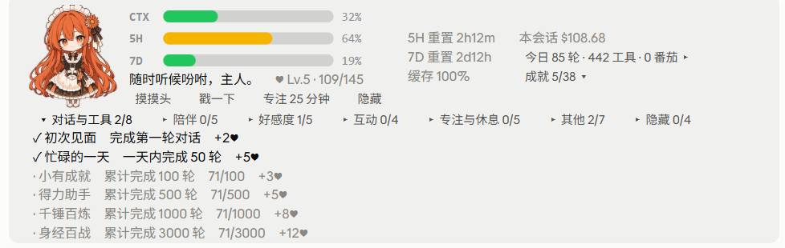
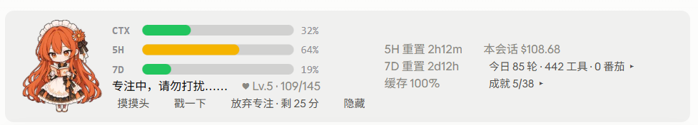
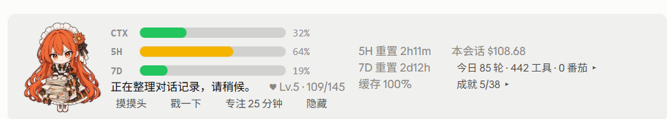

# Pet — a maid mascot for the Claude Code prompt band

A small plugin for Claude Code that puts a Q-version maid mascot above the prompt box. She reacts to what Claude is doing, shows your usage at a glance, and slowly grows fond of you.

> **Language note:** all in-app text (her lines, buttons, achievements) is **Chinese (简体中文)** for now. It is an unofficial community plugin and is not affiliated with Anthropic.

> **Tested version / 已测试版本：Claude Code 2.1.286** (desktop). Other versions are untested. The terminal layout has only been checked by automated tests, not by eye. 其他版本未验证；终端版只在自动化测试里验证过，没有实际观察。

## 截图 / Screenshots

日常状态：小人、CTX / 5H / 7D 进度条、重置倒计时、缓存命中率、今日统计、好感度。


成就面板：按分类折叠，已解锁和未解锁分开显示，未解锁的显示进度和奖励。



番茄钟专注中，以及压缩上下文时的专属姿势：





## 这是什么

一个放在 Claude Code 输入框上方的桌宠（橙发 Q 版女仆）。她会根据 Claude 的状态做出反应，顺便把额度用量显示出来，还有好感度、成就、番茄钟这些小玩意。

## 功能

**状态反应**：待机、工作、思考、等你确认、完成、犯困（5 分钟没动静；番茄钟计时期间不会犯困）、出错担心、启动招手、压缩上下文中。待机/工作/思考等姿势会眨眼。

**用量一览**：CTX（上下文）、5H、7D 三条进度条，5H/7D 的重置倒计时，缓存命中率，本会话花费，今日轮数/工具/番茄数。

**互动**
- 摸摸头、戳一下：有各自的反应和台词；摸头每天前 5 次加好感度。
- 随时可以点“隐藏”收起桌宠，再点“显示桌宠”叫出来；番茄钟进行中按钮会变成“放弃专注 · 剩 N 分”。
- 好感度 20 级、3 个阶段（Lv.1–6 主仆，Lv.7 起朋友，Lv.14 起家人），台词和升级姿势随阶段变化。
- 成就 38 个（含 4 个隐藏成就）：分组折叠、已解锁/未解锁分开显示、累计型成就显示进度，解锁后按难度奖励好感度。
- 每日首次使用问候，连续使用天数。

**提醒**
- 连续工作 1 小时提醒休息（可点“知道啦”）。超过 15 分钟没动静就算休息、重新计时；一轮运行很久的任务算连续工作；等你确认权限的时间不算。
- 一轮任务超过 2 分钟，完成后有专属提醒。
- 5 小时额度到 80%、上下文到 85% 时提醒（每次越过阈值提醒一次，回落到阈值以下 5 个百分点后会重新提醒；5 小时额度按重置周期，多个对话只提醒一次）。
- 上下文到 80% 时出现“压缩上下文”按钮：只会把 `/compact ` 填进输入框，由你按回车确认，不会自动发送；输入框里已经有内容时不会覆盖，会提示你先发送或清空。

**番茄钟**：25 分钟专注，结束后自动进入 5 分钟休息（发消息、开新番茄钟或点“结束休息”会提前结束；摸头和戳一下不会）。电脑睡眠等原因导致番茄钟结束得太晚（超过 5 分钟才被发现）时，不计入番茄。

**今日小结**：点“今日 N 轮 …”展开当天和累计的统计（窗口够宽时在右侧信息栏里，窗口较窄时在按钮行里）。

**演示命令**：`/pet <long|rest|ach|hello|focus|break|compact|warn|level N|start|cancel|version>` 可以预览各种提醒和姿势，不计入任何统计（`/pet rest` 演示出来的休息提醒也不会让你累计“不听劝”）。

## 安装

需要一个带插件“hooks 模块”能力的 Claude Code（开发和测试用的是 **2.1.286**，更早或更晚的版本没有验证过）。

方式一：单次会话加载

```bash
claude --plugin-dir /path/to/pet
```

方式二：每个新会话自动加载。在 `~/.claude/settings.json` 里加入（路径换成你自己的）：

```json
{
  "env": {
    "CLAUDE_CODE_PLUGIN_DIRS": "/path/to/pet"
  }
}
```

Windows 路径要写成 `D:\\path\\to\\pet`。以上安装方式在 Claude Code 2.1.286 上验证过，多个路径的分隔符等细节没有验证。新装或更新后，新开的对话会自动加载；已经打开的对话可以在输入框里输入 `/reload-plugins` 立即加载，再用 `/pet version` 确认加载的是哪一次构建。

## 各界面的表现

| 界面 | 表现 |
|---|---|
| 桌面端 Code 标签页 | 完整版：小人图像、进度条、按钮、右侧信息栏。窗口窄于约 90 格时自动隐藏右栏，“今日”和“成就”两个按钮会改到按钮行里，仍然可以点。 |
| 终端 | 精简版：一行文字状态加同样的按钮和面板，没有图片和进度条图形。 |
| 其他界面 | 与终端相同的文字版。 |

终端版和其他界面只在自动化测试里验证过，没有逐一实际观察。

## 关于数据

- 5H / 7D 额度、花费、上下文百分比都来自 Claude Code 本身提供的数据。当前账号没有提供某项时（例如使用 API 密钥的账号可能没有 5H/7D 额度），对应位置显示 `--`，其余功能不受影响。
- 好感度、成就、统计、连续天数保存在 Claude Code 的插件存档里，所有对话共用。存档位置由 Claude Code 决定：在作者的电脑上是 `~/.claude/plugins/store/` 下的一个 JSON 文件，其他版本没有验证。想重置，删掉该文件即可。
- 插件不联网，只读取自己的 `assets/` 图片，并通过 Claude Code 的插件接口读写存档。点“压缩上下文”时，会读一下输入框是否为空，并把 `/compact ` 填进去（不保存、不上传、不发送）。

## 版本更新

每个版本改了什么，见 [CHANGELOG.md](CHANGELOG.md)。

## 开发

```bash
claude plugin validate .   # 检查插件结构和 hooks
claude plugin test .       # 运行 pet.test.ts（慢一点的机器上个别测试可能需要更久）
```

目录说明：`hooks/register.tsx` 是主逻辑（构建产物），`assets/` 是各姿势的 WebP 图片（运行时按需读取），`types/index.d.ts` 是状态类型声明，`pet.test.ts` 是测试。

## 许可 / License

- **代码**：[MIT License](LICENSE)，Copyright (c) 2026 Firefade0329。
- **图片**（`assets/` 下的角色图）：由 AI 工具生成，**不在 MIT 协议的授权范围内**，版权和使用许可另行说明。如需在本项目之外使用这些图片，请先联系作者。

*Code is MIT-licensed. The character images in `assets/` are AI-generated and are not covered by the MIT license; contact the author before reusing them elsewhere.*
